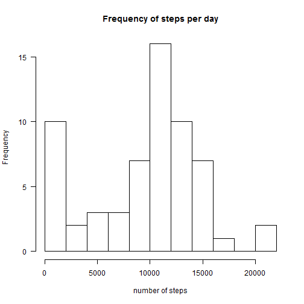
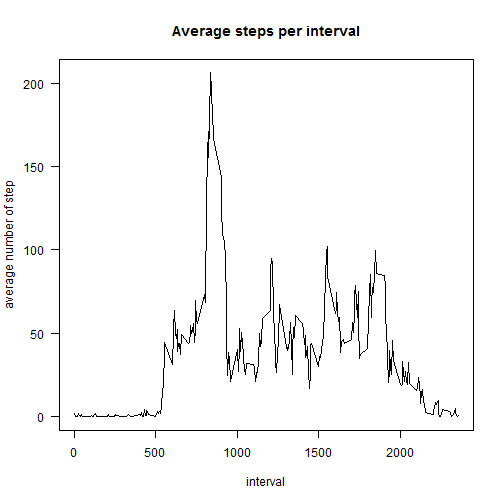

Reproducible research - project1
=================================

This document was created for project in Reproducible research course.
Aim of this project is doing some data analysis and report results. The dataset (Activity monitoring data) for project is available [here](https://d396qusza40orc.cloudfront.net/repdata%2Fdata%2Factivity.zip).  
I add brief information about dataset below.
(original source is [here](https://class.coursera.org/repdata-015/human_grading/view/courses/973516/assessments/3/submissions).)  

The variables included in this dataset are:  
- steps: Number of steps taking in a 5-minute interval.  
- date: The date on which the measurement was taken in YYYY-MM-DD format.  
- interval: Identifier for the 5-minute interval in which measurement was taken.  

The dataset is stored in a comma-separated-value (CSV) file and there are a total of 17,568 observations in this dataset.  

(Note: If you want to "run" RMarkdown document in Rstudio/R, please download and unzip dataset and store this RMarkdown file in your working directory.)  

We want to find answers on following questions/ do following things:  
- **What is mean total number of steps taken per day?**  
- **What is the average daily activity pattern?**  
- **Imputing missing values**  
- **Are there differences in activity patterns between weekdays and weekends?**  

Before we start we need to load data:  

```r
activity <- read.csv("activity.csv")
```
Quick look on our dataset:  

```r
head(activity)
```

```
##   steps       date interval
## 1    NA 2012-10-01        0
## 2    NA 2012-10-01        5
## 3    NA 2012-10-01       10
## 4    NA 2012-10-01       15
## 5    NA 2012-10-01       20
## 6    NA 2012-10-01       25
```
and  

```r
summary(activity)
```

```
##      steps                date          interval     
##  Min.   :  0.00   2012-10-01:  288   Min.   :   0.0  
##  1st Qu.:  0.00   2012-10-02:  288   1st Qu.: 588.8  
##  Median :  0.00   2012-10-03:  288   Median :1177.5  
##  Mean   : 37.38   2012-10-04:  288   Mean   :1177.5  
##  3rd Qu.: 12.00   2012-10-05:  288   3rd Qu.:1766.2  
##  Max.   :806.00   2012-10-06:  288   Max.   :2355.0  
##  NA's   :2304     (Other)   :15840
```

We are ready now to answer questions.  
  
  
## 1.What is mean total number of steps taken per day?  

Let's calculate total number of steps per day.  

```r
library(dplyr)
```

```r
steps_per_day <- group_by(activity,date)
steps_per_day <- summarize(steps_per_day, total_steps = sum(steps,na.rm=TRUE))
head(steps_per_day)
```

```
## Source: local data frame [6 x 2]
## 
##         date total_steps
## 1 2012-10-01           0
## 2 2012-10-02         126
## 3 2012-10-03       11352
## 4 2012-10-04       12116
## 5 2012-10-05       13294
## 6 2012-10-06       15420
```
Here is histogram of the total number of steps taken each day:  

```r
hist(steps_per_day$total_steps, main = "Frequency of steps per day",xlab = "number of steps", breaks = 10, las = 1)
```

 

Calculate mean and median of total steps:  

```r
mean <- mean(steps_per_day$total_steps)
median <- median(steps_per_day$total_steps)
```

**9354.2295082** is mean and **10395** is median of total number of steps taken per day.  
  
  
## 2. What is the average daily activity pattern?  

Let's calculate average number of steps taken per interval and averaged across all days.  

```r
steps_per_interval <- group_by(activity,interval)
steps_per_interval <- summarize(steps_per_interval, avg_steps = mean(steps,na.rm=TRUE))
head(steps_per_interval)
```

```
## Source: local data frame [6 x 2]
## 
##   interval avg_steps
## 1        0 1.7169811
## 2        5 0.3396226
## 3       10 0.1320755
## 4       15 0.1509434
## 5       20 0.0754717
## 6       25 2.0943396
```
Here is the plot of the 5-minute interval and the average number of steps:  

```r
plot(steps_per_interval$interval,steps_per_interval$avg_steps, type = "l", xlab = "interval", ylab = "average number of step", main = "Average steps per interval", las = 1)
```

 

Find interval where number of steps takes its maximum:  

```r
max <- steps_per_interval[steps_per_interval[2] == max(steps_per_interval$avg_steps),1]
```
Interval, which contains the maximum number of steps on average across all days is **835**.  

## 3. Imputing missing values  
  
  
Let's calculate number of missing values in original dataset.  

```r
NA_values <- sum(is.na(activity$steps))
```
Dataset contains **2304** NA values.  

We create new dataset with name **activity_without_NA**. We fill NA values in particular 5-min interval with average number of step in this interval.  
We have already calculated average steps per interval across days.   
Let's look on dataset where this information is stored:  

```r
head(steps_per_interval)
```

```
## Source: local data frame [6 x 2]
## 
##   interval avg_steps
## 1        0 1.7169811
## 2        5 0.3396226
## 3       10 0.1320755
## 4       15 0.1509434
## 5       20 0.0754717
## 6       25 2.0943396
```
Let's create a new dataset that is equal to the original dataset but with the missing data filled in.  

```r
activity_without_NA <- activity
for (i in seq_along(activity_without_NA$steps))
{
  if (is.na(activity_without_NA$steps[i])) 
	{
		interval_val <- activity_without_NA$interval[i]       
		avg_steps <- as.numeric(steps_per_interval[steps_per_interval$interval ==interval_val,2])
		activity_without_NA$steps[i] <- avg_steps
	}
}
```
and look how does it look like:  

```r
head(activity_without_NA)
```

```
##       steps       date interval
## 1 1.7169811 2012-10-01        0
## 2 0.3396226 2012-10-01        5
## 3 0.1320755 2012-10-01       10
## 4 0.1509434 2012-10-01       15
## 5 0.0754717 2012-10-01       20
## 6 2.0943396 2012-10-01       25
```

```r
summary(activity_without_NA)
```

```
##      steps                date          interval     
##  Min.   :  0.00   2012-10-01:  288   Min.   :   0.0  
##  1st Qu.:  0.00   2012-10-02:  288   1st Qu.: 588.8  
##  Median :  0.00   2012-10-03:  288   Median :1177.5  
##  Mean   : 37.38   2012-10-04:  288   Mean   :1177.5  
##  3rd Qu.: 27.00   2012-10-05:  288   3rd Qu.:1766.2  
##  Max.   :806.00   2012-10-06:  288   Max.   :2355.0  
##                   (Other)   :15840
```
We create same histogram as in question 1.:  

```r
steps_per_day_nonNA <- group_by(activity_without_NA,date)
steps_per_day_nonNA <- summarize(steps_per_day_nonNA, total_steps = sum(steps,na.rm=TRUE))
hist(steps_per_day_nonNA$total_steps, main = "Frequency of steps per day (NA eliminated)",xlab = "number of steps", breaks = 10, las = 1)
```

 

Calculate mean and median total number of steps taken again.  
Mean:  

```r
mean(steps_per_day_nonNA$total_steps)
```

```
## [1] 10766.19
```
Median:  

```r
median(steps_per_day_nonNA$total_steps)
```

```
## [1] 10766.19
```
We can see that both values are higher than corresponding values dor dataset with NAs.
  
  
## 4. Are there differences in activity patterns between weekdays and weekends?  

At first we add new factor variable to our dataset without NAs.  

```r
activity_without_NA <- mutate(activity_without_NA, day = weekdays(as.Date(activity$date)) )
activity_without_NA$day<- gsub("Sunday|Saturday", "weekend", activity_without_NA$day)
activity_without_NA$day<- gsub("Monday|Tuesday|Wednesday|Thursday|Friday", "weekday", activity_without_NA$day)
activity_without_NA$day <-as.factor(activity_without_NA$day)
```
Quick look on data:  

```r
head(activity_without_NA)
```

```
##       steps       date interval     day
## 1 1.7169811 2012-10-01        0 weekday
## 2 0.3396226 2012-10-01        5 weekday
## 3 0.1320755 2012-10-01       10 weekday
## 4 0.1509434 2012-10-01       15 weekday
## 5 0.0754717 2012-10-01       20 weekday
## 6 2.0943396 2012-10-01       25 weekday
```
and  

```r
str(activity_without_NA)
```

```
## 'data.frame':	17568 obs. of  4 variables:
##  $ steps   : num  1.717 0.3396 0.1321 0.1509 0.0755 ...
##  $ date    : Factor w/ 61 levels "2012-10-01","2012-10-02",..: 1 1 1 1 1 1 1 1 1 1 ...
##  $ interval: int  0 5 10 15 20 25 30 35 40 45 ...
##  $ day     : Factor w/ 2 levels "weekday","weekend": 1 1 1 1 1 1 1 1 1 1 ...
```
Now we create a panel plot containing a time series plot of the 5-minute interval (x-axis) and the average number of steps taken, averaged across all weekday days or weekend days (y-axis):  

```r
weekdays_avg_steps <- group_by(activity_without_NA, interval,day)
weekdays_avg_steps <- summarize(weekdays_avg_steps, avg_steps = mean(steps))
library(lattice)
xyplot(avg_steps ~ interval | day, data = weekdays_avg_steps, layout = c(1,2) , type = "l", ylab = "number of avg steps")
```

 
